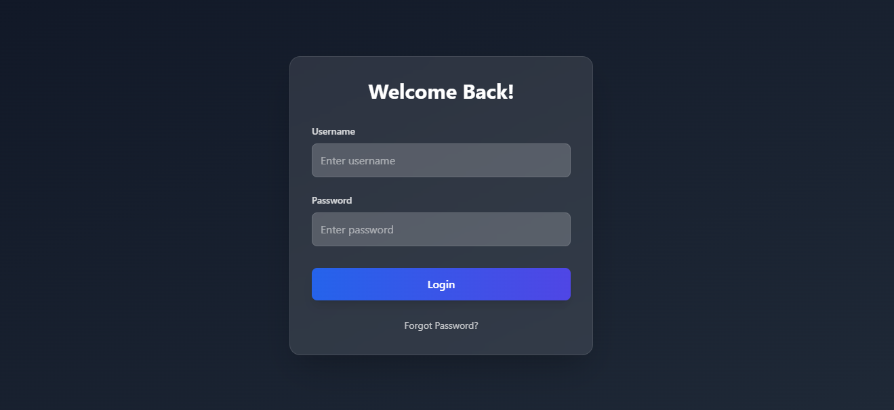
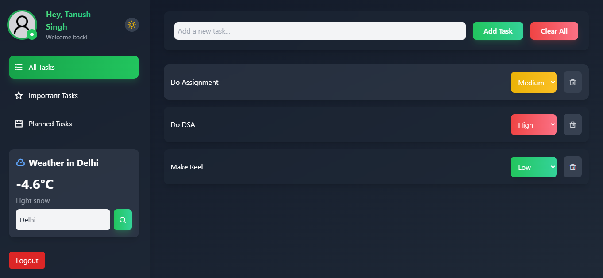
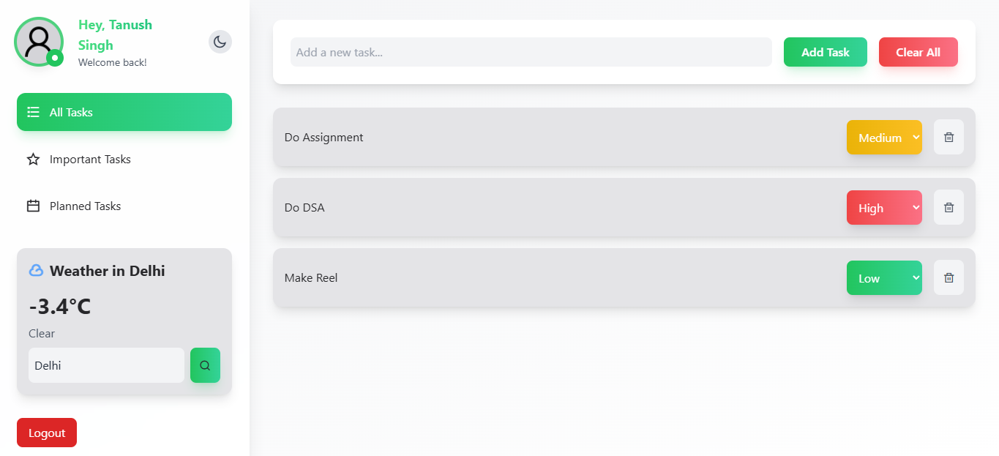

# Advanced React To-Do Application

## 🚀 Project Overview
This is an advanced React To-Do application designed to manage tasks with features like user authentication, task prioritization, and real-time weather integration. The app uses Redux for state management and supports responsive design for seamless user experience across all devices.

## 🌟 Features
- **User Authentication**: Login/logout functionality (mocked, using localStorage)
- **Task Management**:
  - Add new tasks
  - Prioritize tasks (Low, Medium, High)
  - Delete individual tasks or clear all
- **Weather Integration**: Displays current weather using an external API
- **State Management**: Implemented using Redux and Redux Thunk
- **Dark Mode**: Toggle dark and light themes
- **Responsive Design**: Adapts to mobile, tablet, and desktop views
- **404 Page**: Handles invalid routes gracefully

## 🏗️ Project Structure
```
/src
│-- /components
│   │-- ProtectedRoute.jsx
│   │-- TaskInput.jsx
│   │-- TaskList.jsx
│-- /pages
│   │-- Login.jsx
│   │-- ToDo.jsx
│-- /redux
│   │-- actions.jsx
│   │-- reducers.jsx
│   │-- store.jsx
│-- /public
│-- /src
│-- App.jsx
│-- index.js
│-- README.md
```

## ⚙️ Installation

1. Clone the repository:
```bash
git clone <repository-url>
```

2. Navigate into the project directory:
```bash
cd advanced-todo-app
```

3. Install dependencies:
```bash
npm install
```

4. Create a `.env` file in the root and add your weather API key:
```plaintext
VITE_WEATHER_API_KEY=your_api_key_here
```

5. Run the development server:
```bash
npm run dev
```

## 🌐 Deployment
To deploy the app using Vercel:

1. Install Vercel CLI:
```bash
npm i -g vercel
```

2. Deploy:
```bash
vercel
```

3. Follow the prompts and get your live deployment URL.

## 📸 Screenshots
Include screenshots of your app's key features, like:

### Login Page

### To-Do List

### Light Theme


## 🧪 Testing
Ensure all functionalities work correctly:
- Add, update, and delete tasks
- Check authentication (login/logout flow)
- Verify weather data fetching
- Test responsive design on different screen sizes

## 📤 Submission
1. Push your code to GitHub:
```bash
git add .
git commit -m "Initial commit"
git push origin main
```

2. Submit your GitHub repo link and live site URL using this [Google Form](https://docs.google.com/forms/d/e/1FAIpQLSeQ-9PffLbFkzTFfNNv6SqmlyKhV8OT5TJVkPiHBOq9G1-YTQ/viewform).

## 📧 Contact
For any issues, reach out via email:
- **hr.quadbtech@gmail.com** (use subject: *React JS Internship*)

---

Let me know if you want me to tweak anything! ✨

